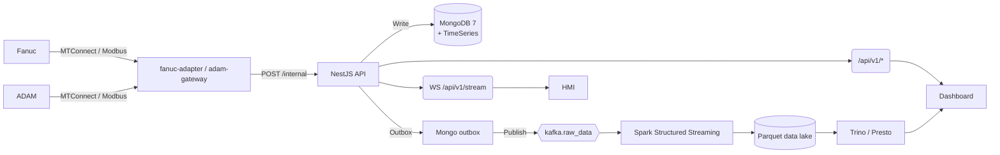

# MTConnect – Финальная архитектурная схема (MVP → Scale-ready)

> Версия: 2025-07-06 / автор: Андрей + AI-архитектор

---
## I. Границы системы

| Контур | Назначение |
|--------|------------|
| **Ingest** | Приём телеметрии со станков Fanuc (MTConnect) и модулей ADAM-6050 (Modbus/TCP) |
| **Core API** | REST + WebSocket сервис (NestJS) – единая точка доступа к данным |
| **Event Bus** | Kafka → Spark Streaming – offline-аналитика, ML, отчёты |
| **UI** | 1) HMI для операторов (реальное время); 2) Dashboard для менеджеров (агрегации) |

---
## II. Хранилища и стратегия ID

| Сущность            | База / Bucket          | Ключи                          | TTL / Partition |
|---------------------|------------------------|--------------------------------|-----------------|
| machines            | Mongo collection       | `uuid`, `tenant_id`            | –               |
| raw_machine_data    | Mongo TimeSeries       | `uuid(machine)`, `timestamp`   | 30 дней         |
| events / outbox     | Mongo collection       | `ulid(event_id)`               | –               |
| kafka.raw_data      | Kafka topic (JSON)     | key = `uuid(machine)`          | log-compacted   |
| offline_results     | Parquet @ S3 / Minio   | `date`, `machine_id`           | by day          |

* Сейчас `tenant_id = "plant-1"`; поле заложено для будущего multi-tenant.
* Схемы версионируются через JSON-schema (`schema_version`).

---
## III. Потоки данных



---
## IV. Технологический стек

| Слой           | Технологии |
|----------------|------------|
| Backend / API  | Node 18, NestJS 10, TypeScript 5, RxJS |
| DB online      | MongoDB 7 (TimeSeries, Change Streams) |
| Cache / PubSub | Redis 7 (rate-limit, WS fan-out) |
| Message Bus    | Kafka 3 (KRaft 3 brokers) |
| Batch / ML     | Spark 3.5 (+ Delta Lake, PySpark) |
| Frontend (HMI) | React 18 + Socket.IO + AntD/Mantine |
| Frontend (Dash)| React 18 + React-Query + ECharts |
| Design System  | Storybook + Chromatic |
| Container/Dev  | Docker Compose → Helm charts / K8s |

---
## V. Контракты и DX

* **OpenAPI v1** – источник правды для REST; при мерже генерируются:
  * Postman Collection
  * typed‐SDK `@mtc/sdk` (TypeScript, Python)
* **Kafka события** – JSON CloudEvents + Avro, схемы в Confluent SR.
* **Pact-тесты** – в CI между сервисами.
* **Dummy-data generator** – наполняет песочницу + выдаёт публичный API-key.

---
## VI. Масштабирование и HA

| Слой      | Масштабирование       | HA-подход |
|-----------|-----------------------|-----------|
| API       | Kubernetes HPA (CPU,RPS) | Stateless + graceful 30 s |
| Workers   | Keda scaler по Kafka lag | Retry + DLQ |
| MongoDB   | 3-node ReplicaSet + arbiter | Read‐replica для Spark/Trino |
| Kafka     | 3 brokers (KRaft) | replication factor = 3 |
| Spark     | Job-pods auto-scale | Checkpoint в S3 |
| Frontend  | CDN + long-cache | Blue-green deploy |

---
## VII. Безопасность

* JWT + RBAC (`role=operator|manager|admin`), scopes в claims.
* API-Key (header `X-API-Key`) для сторонних систем.
* mTLS между сервисами (Istio sidecar) – закладка, включаем по требованию.
* WebHook HMAC SHA-256 подпись.
* Secrets → K8s Secrets / HashiCorp Vault, **никогда** в env-файлах.

---
## VIII. CI / CD

1. GitHub Actions workflow:
   ```yaml
   jobs:
     build:
       steps: [lint, unit, contract, e2e]
     docker:
       needs: build
       steps: [docker build, push GHCR]
     helm-deploy:
       needs: docker
       steps: [helm upgrade –install staging]
   ```
2. After-merge tag → publish SDK & Postman.
3. Canary deploy (5 %) + automatic rollback по SLO.

---
## IX. UI-персоны и требования

| Персона    | Устройство           | Ключевые фичи |
|------------|----------------------|---------------|
| Оператор   | Kiosk 1080p, тачскрин| Real-time графики (<1 s), тёмная тема, offline fallback |
| Менеджер   | Desktop + Mobile     | Агрегаты OEE, drill-down, экспорт CSV, фильтры (shift/lot) |

---
## X. Roadmap (первые 30 дней)

1. **Инфраструктура**
   * Docker Compose: Mongo RS, Redis, Kafka + UI.
2. **Core API v0.1**
   * `/internal/machines/:id/data` ingestion
   * `/api/v1/machines` public
3. **Outbox → Kafka**
   * Worker + DLQ
4. **Spark PoC**
   * OEE по минутам из `kafka.raw_data`
5. **HMI MVP**
   * Live-page на Socket.IO (mock-stream)

---
**Файл зафиксирован. Возобновим работу с реализации.** 