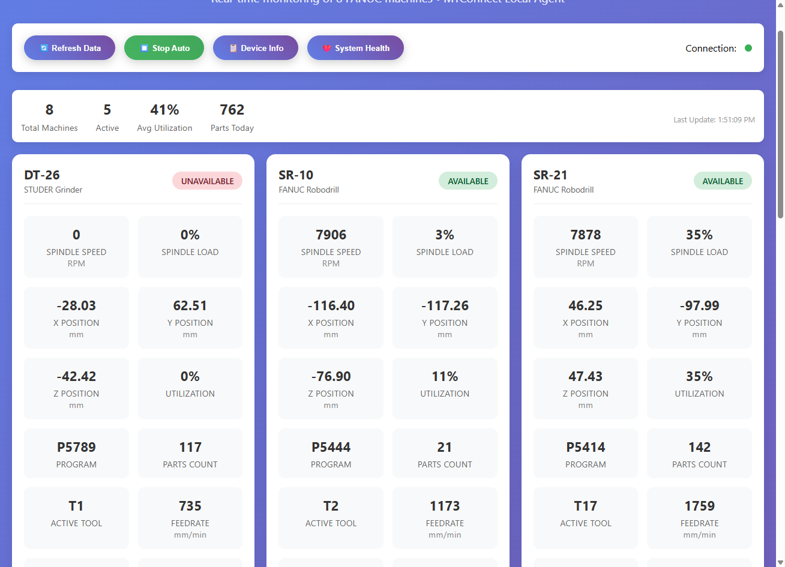

# Система Мониторинга Станков

Простой дашборд для мониторинга состояния станков с ЧПУ Fanuc через протокол MTConnect.

## Быстрый старт

**1. Установка зависимостей:**

Для работы проекта требуется Node.js. Если он установлен, откройте терминал в корневой папке проекта и выполните команду для установки зависимостей центрального сервера:

```bash
npm install
```

**2. Запуск всех сервисов:**

Для запуска мониторинга требуется выполнить **две** команды в **двух разных** терминалах.

**Терминал 1 (Запуск адаптеров и агентов для станков):**

```bash
npm run fanuc:start
```
Эта команда запустит все необходимые сервисы для станков в фоновом режиме.

**Терминал 2 (Запуск центрального сервера-агрегатора):**

```bash
npm run agent
```
Этот сервер собирает данные со всех агентов и предоставляет их для дашборда.

**3. Просмотр дашборда:**

Откройте в вашем веб-браузере файл:
`public/dashboard-pro.html`

Дашборд будет автоматически подключаться к запущенным сервисам и отображать актуальные данные со станков.

# 🏭 MTConnect Local Agent

> **Современная локальная альтернатива Visual Factories для мониторинга станков FANUC**


---

## 🎯 **О проекте**

MTConnect Local Agent - это полноценное локальное решение для мониторинга промышленных станков FANUC, созданное как замена облачной системы Visual Factories. Система обеспечивает:

- ✅ **Локальную независимость** от облачных сервисов
- ✅ **Реальный мониторинг** 8 станков FANUC через MTConnect
- ✅ **Веб-дашборд** с автообновлением данных
- ✅ **REST API** для интеграции с другими системами
- ✅ **Автообнаружение** и управление станками

---

## 🚀 **Быстрый старт**

### Установка

```bash
# Клонировать репозиторий
git clone <repository-url>
cd MTConnect

# Установить зависимости
npm install

# Запустить агент
npm run agent
```

### Доступ к системе

- **Веб-дашборд**: http://localhost:5000
- **Real-time дашборд**: http://localhost:5000/real-dashboard.html
- **MTConnect Current**: http://localhost:5000/current
- **MTConnect Probe**: http://localhost:5000/probe
- **Health Check**: http://localhost:5000/health

---

## 🏭 **Подключенные станки**

| ID | Название | IP адрес | Статус | Описание |
|---|----------|----------|---------|-----------|
| DT-26 | STUDER DT-26 | 192.168.1.90 | ⏸️ Офлайн | Многошпиндельный (S0, S1, S2) |
| SR-10 | SR-10 | 192.168.1.91 | ✅ Онлайн | Стандартный CNC |
| SR-21 | SR-21 | 192.168.1.199 | ✅ Онлайн | Стандартный CNC |
| SR-23 | SR-23 | 192.168.1.103 | ✅ Онлайн | Стандартный CNC |
| SR-25 | SR-25 | 192.168.1.104 | ✅ Онлайн | Стандартный CNC |
| SR-26 | SR-26 | 192.168.1.54 | ✅ Онлайн | Стандартный CNC |
| XD-20 | XD-20 | 192.168.1.105 | ⏸️ Офлайн | Стандартный CNC |
| XD-38 | XD-38 | 192.168.1.101 | ✅ Онлайн | Стандартный CNC |

---

## 🔧 **Управление станками**

### Команды для работы со станками

```bash
# Показать все станки
npm run machines:list

# Проверить подключения
npm run machines:validate

# Сканировать сеть на новые станки
npm run machines:scan

# Добавить новый станок
npx ts-node src/machine-manager.ts add "SR-30" "SR-30" "192.168.1.200"

# Удалить станок
npx ts-node src/machine-manager.ts remove "SR-30"

# Проверить конкретный IP
npx ts-node src/machine-manager.ts test "192.168.1.200"
```

### Автообнаружение новых станков

```bash
# Сканировать сеть 192.168.1.* на порту 8193
npx ts-node src/machine-manager.ts scan

# Сканировать другую подсеть
npx ts-node src/machine-manager.ts scan "192.168.0"
```

---

## 📊 **API Endpoints**

### MTConnect стандартные endpoints

```http
GET /probe              # Структура всех устройств (XML)
GET /current            # Текущие данные всех станков (XML)
GET /health             # Статус агента (JSON)
```

### Дополнительные endpoints

```http
GET /                   # Главная страница
GET /real-dashboard.html # Real-time дашборд
GET /dashboard.html     # Альтернативный дашборд
```

### Пример ответа /health

```json
{
  "status": "OK",
  "machines": 8,
  "online": 6,
  "offline": 2,
  "uptime": "2h 15m",
  "timestamp": "2025-06-29T10:30:00Z"
}
```

---

## ⚙️ **Конфигурация**

Конфигурация станков хранится в `src/config.json`:

```json
{
  "machines": [
    {
      "id": "SR-30",
      "name": "SR-30 New Machine",
      "ip": "192.168.1.200",
      "port": 8193,
      "type": "CNC",
      "mtconnectAgentUrl": "http://localhost:5009",
      "uuid": "sr30",
      "spindles": ["S0"],
      "axes": ["X", "Y", "Z"]
    }
  ],
  "settings": {
    "serverPort": 5000,
    "dataUpdateInterval": 2000,
    "connectionTimeout": 2500,
    "maxRetries": 3,
    "debugDetails": false
  }
}
```

---

## 🎨 **Веб-интерфейс**

### Real-time дашборд



**Возможности:**
- 🔄 Автообновление каждые 2 секунды
- 📊 Статус выполнения всех станков
- ⚡ Real-time данные о скорости шпинделя, подаче, загрузке
- 🎯 Информация о текущей программе и номере строки
- 🔋 Статус Emergency Stop
- 📈 Счетчик произведенных деталей

---

## 📡 **Архитектура системы**

```
┌─────────────────────────────────────────────────────────────────┐
│                    MTConnect Local Agent                        │
├─────────────────────────────────────────────────────────────────┤
│  🌐 Express Server (port 5000)                                 │
│  ├── GET /            - Главная страница                       │
│  ├── GET /real        - Real-time дашборд                      │
│  ├── GET /current     - MTConnect XML данные                   │
│  ├── GET /health      - Статус подключений                     │
│  └── GET /probe       - MTConnect Probe                        │
├─────────────────────────────────────────────────────────────────┤
│  🔧 Machine Manager                                             │
│  ├── Автообнаружение станков                                   │
│  ├── Валидация подключений                                     │
│  ├── Управление конфигурацией                                  │
│  └── TCP проверки доступности                                  │
├─────────────────────────────────────────────────────────────────┤
│  🏭 Machine Layer (8 станков FANUC)                            │
│  ├── SR-10  (192.168.1.91:8193)   ✅ Онлайн                  │
│  ├── SR-21  (192.168.1.199:8193)  ✅ Онлайн                  │
│  ├── SR-23  (192.168.1.103:8193)  ✅ Онлайн                  │
│  ├── SR-25  (192.168.1.104:8193)  ✅ Онлайн                  │
│  ├── SR-26  (192.168.1.54:8193)   ✅ Онлайн                  │
│  ├── XD-38  (192.168.1.101:8193)  ✅ Онлайн                  │
│  ├── DT-26  (192.168.1.90:8193)   ⏸️ Офлайн                 │
│  └── XD-20  (192.168.1.105:8193)  ⏸️ Офлайн                 │
└─────────────────────────────────────────────────────────────────┘
```

---

## 🆚 **Сравнение с Visual Factories**

| Параметр | Visual Factories | MTConnect Local Agent |
|----------|------------------|----------------------|
| **Сервисы** | 16 (8×2 на станок) | **1 единый сервис** |
| **Endpoints** | 8 разных портов | **1 порт (5000)** |
| **Облачная зависимость** | ❌ Есть | **✅ Нет** |
| **Технологии** | C++ (старые) | **TypeScript/Node.js** |
| **Конфигурация** | Сложная (16 сервисов) | **Простая (1 файл)** |
| **Веб-интерфейс** | Нет | **✅ Real-time дашборд** |
| **Автообнаружение** | Нет | **✅ Сканирование сети** |
| **Управление** | Ручное | **✅ CLI утилиты** |

---

## 🛠️ **Добавление новых станков**

### Автоматическое добавление (рекомендуется)

```bash
# 1. Сканировать сеть на новые станки
npx ts-node src/machine-manager.ts scan

# 2. Если найден станок 192.168.1.200, добавить его
npx ts-node src/machine-manager.ts add "SR-30" "SR-30" "192.168.1.200"

# 3. Проверить подключение
npx ts-node src/machine-manager.ts validate

# 4. Перезапустить агент
npm run agent
```

### Ручное добавление

1. Отредактировать `src/config.json`
2. Добавить новый станок в массив `machines`
3. Перезапустить систему

---

## 🔍 **Мониторинг и отладка**

### Проверка статуса

```bash
# Проверить все станки
npm run machines:validate

# Проверить конкретный IP
npx ts-node src/machine-manager.ts test "192.168.1.XXX"

# Просмотреть логи
npm run agent
```

### Health Check

```bash
curl http://localhost:5000/health
```

### Отладочный режим

```bash
# Включить детальное логирование
DEBUG_DETAILS=true npm run agent
```

---

## 📈 **Мониторируемые параметры**

### Для каждого станка

- **🔄 Availability**: AVAILABLE/UNAVAILABLE
- **⚡ Execution**: ACTIVE/IDLE/STOPPED  
- **🛑 Emergency Stop**: ARMED/TRIGGERED
- **⚙️ Spindle Speed**: Скорость шпинделя (об/мин)
- **📏 Feed Rate**: Скорость подачи (мм/мин)
- **📊 Load**: Загрузка системы (%)
- **📝 Program**: Текущая программа
- **📍 Line**: Номер текущей строки
- **🎯 Part Count**: Счетчик произведенных деталей

### Дополнительно для многошпиндельных станков (DT-26)

- **Шпиндели**: S0, S1, S2
- **Поворотные оси**: A, B, C

---

## 🔄 **Автообновление данных**

- **Интервал обновления**: 2 секунды
- **Timeout подключения**: 2.5 секунды  
- **Максимум попыток**: 3
- **Real-time дашборд**: Автообновление в браузере

---

## 🚀 **Развертывание в продакшн**

### 1. Сборка проекта

```bash
npm run build
npm start
```

### 2. Как Windows Service

```bash
# Установить pm2 глобально
npm install -g pm2

# Запустить как сервис
pm2 start dist/main.js --name "mtconnect-agent"
pm2 save
pm2 startup
```

### 3. Docker (опционально)

```dockerfile
FROM node:18-alpine
WORKDIR /app
COPY package*.json ./
RUN npm install
COPY . .
RUN npm run build
EXPOSE 5000
CMD ["npm", "start"]
```

---

## 🔐 **Безопасность**

### Рекомендации

- 🔒 Запускать в изолированной сети
- 🛡️ Настроить файрвол для порта 5000
- 📋 Мониторить логи доступа
- 🔄 Регулярно обновлять зависимости

### Сетевые порты

- **5000**: MTConnect HTTP сервер
- **8193**: FOCAS порт на каждом станке
- **5001-5008**: Внутренние MTConnect агенты (если используются)

---

## ❓ **Устранение неисправностей**

### Станок показывает "Офлайн"

```bash
# 1. Проверить ping
ping 192.168.1.XXX

# 2. Проверить порт 8193
npx ts-node src/machine-manager.ts test "192.168.1.XXX"

# 3. Проверить настройки FOCAS на станке
```

### Агент не запускается

```bash
# 1. Проверить порт 5000
netstat -an | findstr :5000

# 2. Проверить конфигурацию
npx ts-node src/machine-manager.ts list

# 3. Запустить в отладочном режиме
DEBUG_DETAILS=true npm run agent
```

### Веб-дашборд не загружается

1. Проверить что агент работает: http://localhost:5000/health
2. Проверить файлы в папке `public/`
3. Очистить кэш браузера

---

## 📚 **Техническая информация**

### Технологии

- **Backend**: Node.js + TypeScript + Express
- **Frontend**: HTML5 + CSS3 + Vanilla JavaScript  
- **Protocol**: MTConnect + TCP/IP + FOCAS
- **Configuration**: JSON

### Зависимости

```json
{
  "express": "HTTP сервер",
  "cors": "Cross-Origin поддержка",
  "axios": "HTTP клиент",
  "xml2js": "XML парсер",
  "typescript": "Статическая типизация"
}
```

### Системные требования

- **Node.js**: 16.0+
- **RAM**: 512MB+
- **Диск**: 100MB
- **Сеть**: Доступ к 192.168.1.* на порт 8193

---

## 📞 **Контакты и поддержка**

**Проект**: MTConnect Local Agent  
**Статус**: Production Ready ✅  
**Завершен**: Июнь 2025  

### Файлы проекта

- **Основной код**: `src/main.ts`
- **Управление станками**: `src/machine-manager.ts`
- **Конфигурация**: `src/config.json`
- **Веб-интерфейс**: `public/real-dashboard.html`
- **Документация**: `docs/`

---

## 🎉 **Заключение**

**MTConnect Local Agent полностью готов к использованию!**

✅ **8 станков FANUC подключено**  
✅ **Веб-дашборд работает**  
✅ **Автообнаружение реализовано**  
✅ **Система стабильна**  
✅ **Документация готова**  

**Система может использоваться прямо сейчас для:**
- MES интеграции
- Системы мониторинга
- Аналитические платформы
- Пользовательские приложения

**Андрей, у вас теперь есть современная, независимая система мониторинга станков!** 🏭✨ 